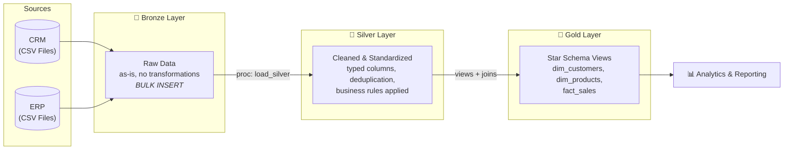
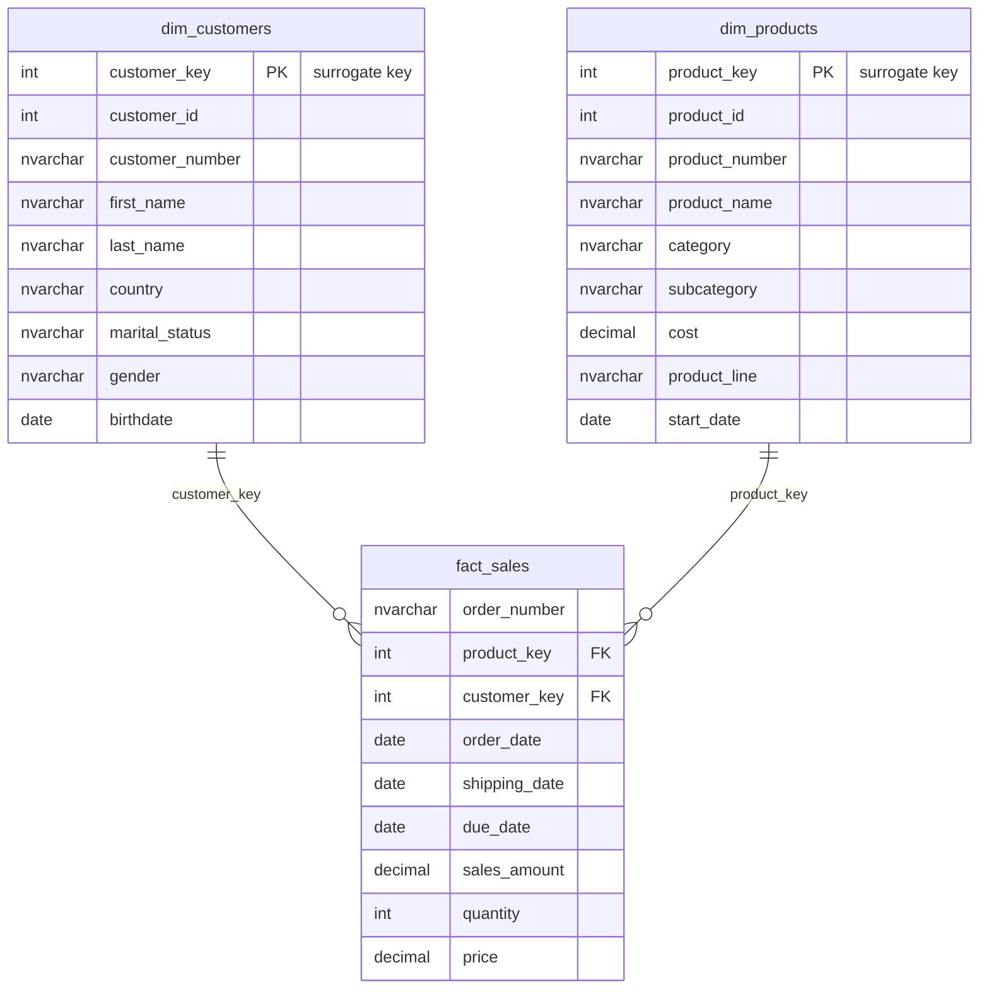

# SQL Data Warehouse Project

Building a modern data warehouse with **SQL Server** — from raw CSV files to a business-ready star schema, including ETL pipelines, data cleansing, and analytics-ready data modeling.

---

## 📖 Project Overview

This project consolidates sales data from two source systems (**CRM** and **ERP**) into a single, analytics-ready data warehouse. It covers the full data engineering lifecycle:

1. **Data Architecture** — Designing a modern warehouse using the Medallion Architecture (Bronze, Silver, Gold layers)
2. **ETL Pipelines** — Extracting, transforming, and loading data from CSV files into SQL Server via stored procedures
3. **Data Cleansing** — Resolving real-world quality issues: duplicates, invalid dates, inconsistent formats, unwanted whitespace, and broken business rules
4. **Data Modeling** — Building fact and dimension views in a star schema, optimized for reporting
5. **Documentation** — A data catalog and quality checks that make the warehouse usable for business teams

**Scale:** ~60,000 sales transactions · ~18,500 customers · ~400 products across 6 source files

---

## 🏗️ Data Architecture

The warehouse follows the **Medallion Architecture** with three layers:



| Layer | Purpose | Object Type | Load Method |
|-------|---------|-------------|-------------|
| **Bronze** | Land raw data exactly as delivered — flexible `NVARCHAR` columns so nothing breaks on ingest | Tables | `BULK INSERT` (full load, truncate & insert) |
| **Silver** | Clean, standardize, and type the data; apply business rules | Tables | Stored procedure with transformations |
| **Gold** | Business-ready star schema with surrogate keys and friendly column names | Views | Joins & enrichment on Silver |

---

## ⭐ Data Model (Star Schema)



The Gold layer integrates both source systems: customer data is enriched with ERP demographics (birthdate, gender fallback logic) and geography, while products are joined with their category hierarchy.

---

## 🧹 Data Quality Highlights

The raw sources contain deliberate real-world messiness. Key transformations in the Silver layer:

- **Deduplication** — Keep only the latest customer record per ID using `ROW_NUMBER()` window functions
- **Date repair** — Convert integer dates (`20101229`) to proper `DATE`, null out invalid values (zero, wrong length)
- **Business rule enforcement** — Recalculate `sales = quantity × price` where source values are missing, negative, or inconsistent
- **Standardization** — Map coded values to readable ones (`M` → `Married`, `DE` → `Germany`), trim whitespace, unify gender values across CRM & ERP
- **Historization logic** — Derive product end dates from the next version's start date via `LEAD()`
- **Cross-system key alignment** — Normalize customer keys (`NAS`-prefix removal, dash stripping) so CRM and ERP records join correctly

A dedicated [quality check script](scripts/silver/searching_for_bad_data/quality_checks_silver.sql) validates the Silver layer after each load: primary key integrity, date order logic, referential consistency, and standardization results.

---

## 📂 Repository Structure

```
sql-data-warehouse-project/
│
├── datasets/                            # Source CSV files
│   ├── source_crm/                      # cust_info, prd_info, sales_details
│   └── source_erp/                      # CUST_AZ12, LOC_A101, PX_CAT_G1V2
│
├── docs/                                # Architecture & design documentation (draw.io)
│   ├── 01_high_level_arch/              # High-level architecture diagram
│   ├── bronze_layer/                    # Bronze data flow & integration strategy
│   ├── silver_layer/                    # Silver data flow & integration model
│   ├── gold_layer/                      # Star schema & gold data flow diagrams
│   └── data_catalog.md                  # Column-level documentation of the Gold layer
│
├── scripts/
│   ├── init_database_sql.sql            # Create database & schemas (bronze/silver/gold)
│   ├── bronze/
│   │   ├── 01_ddl_bronze_blueprint.sql  # Raw landing tables
│   │   └── 02_proc_load_bronze.sql      # BULK INSERT load procedure
│   ├── silver/
│   │   ├── 01_ddl_silver_blueprint.sql  # Typed, standardized tables
│   │   ├── 02_proc_load_silver.sql      # ETL procedure (cleansing & transformation)
│   │   └── searching_for_bad_data/
│   │       └── quality_checks_silver.sql  # Post-load data quality validation
│   └── gold/
│       └── ddl_gold.sql                 # Star schema views
│
└── README.md
```

---

## 🛠️ Skills Demonstrated

| Skill | Where to see it |
|-------|----------------|
| **Data Warehouse Design** (Medallion Architecture, layered ETL) | Schema setup, Bronze → Silver → Gold flow |
| **Dimensional Modeling** (star schema, surrogate keys, fact/dim separation) | `gold/` views |
| **T-SQL Development** (stored procedures, window functions, `TRY...CATCH`, dynamic error logging) | `load_bronze`, `load_silver` procedures |
| **Data Cleansing & Standardization** | Silver ETL transformations |
| **Data Quality Testing** | `quality_checks_silver.sql` |
| **Performance awareness** (`TABLOCK` bulk loads, `SIMPLE` recovery model, `TRY_CAST` for safe typing) | Load procedures & DB setup |
| **Documentation** | Data catalog, extensively commented scripts |

---

## 🚀 How to Run

1. **Requirements:** SQL Server (Express is sufficient) + SSMS
2. Clone the repository and adjust the CSV file paths in `bronze/load_bronze` to your local `datasets/` folder
3. Run the scripts in order:
   ```
   1. init_database.sql        -- creates DB + schemas
   2. bronze DDL  →  EXEC bronze.load_bronze
   3. silver DDL  →  EXEC silver.load_silver
   4. gold views
   5. quality checks (optional but recommended)
   ```
4. Query the Gold views directly for analytics:
   ```sql
   SELECT c.country, SUM(f.sales_amount) AS total_sales
   FROM gold.fact_sales f
   JOIN gold.dim_customers c ON f.customer_key = c.customer_key
   GROUP BY c.country
   ORDER BY total_sales DESC;
   ```

---

## 🗺️ Roadmap

This data warehouse is the foundation for the analytics phase of the project:

- [x] **Data Warehouse** — Medallion architecture, ETL, star schema *(this repo)*
- [ ] **Exploratory Data Analysis (EDA) Project** — Profiling dimensions, measures, and ranking analyses on the Gold layer
- [ ] **SQL Advanced Data Analytics Project** — Trends over time, cumulative & performance analysis, segmentation, and reporting views

---

## 🎓 Acknowledgments

This project was built by following the course [**Building a Modern Data Warehouse — Data Engineering Bootcamp**](https://www.youtube.com/@DataWithBaraa) by **Baraa Khatib Salkini** ([Data with Baraa](https://www.datawithbaraa.com/)). I wrote, tested, and documented all scripts myself as part of the learning process.

---

## 👤 About Me

Hi, I'm **Daniel Pilipenko** — currently building my data engineering skills through hands-on projects like this one.

[GitHub](https://github.com/DanielPilipenko)
